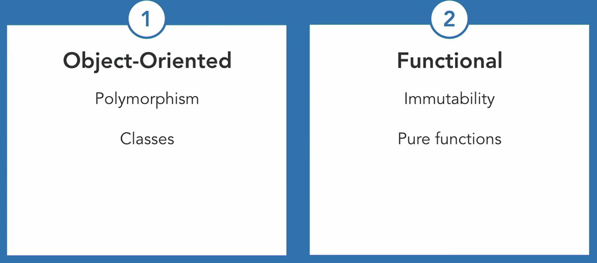

## Functional programing style
- Imumutable variables
- Recursion over loops
- Functions are pure and simple
- Expressions preferred over statements
- Currying manages how arguments are passed to functions


`std::tansform` replaces `map`

`std::copy_if` replaces `filter`

`std::accumulate` replaces `reduce`

`std::bind`

- Manipulate a function and its parameters
- Reorder the function's arguments
- Bind values to arguments
```
 bind(&greaterThan, placeholders::_1, 21));
```
The first argument is the function address. 

`std::function`
- It is a wrapper for invokable objects
- Invokable objects include functions, functors and lambdas
- Can store functions in a vector

`Lambda`
- Unnamed function object
- Create closure over calling scope
- Use the keyword mutable to make changes to the closure

### Chapter 3
Template Metaprogramming
- It is a turning complete, functional programming language built-in to C++
- TMP varibales are always immutable
- TMP doesn't have loops, so we use recursion
- TMP doesn't have braching, use specialization
```
template <int toCube> struct Cube {
  enum { value = toCube * toCube * toCube };
};
```
Standard Template library
- Algorithms, containers, functions and iterators
